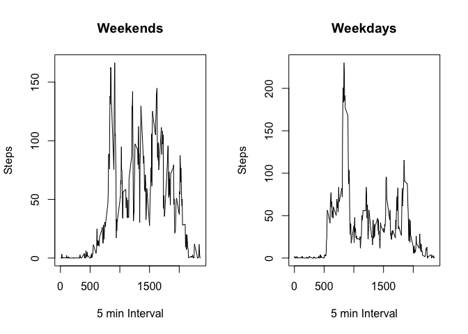

Personal Activity Monitoring Report
-----------------------------------

The objective of this report is to process and analyse data colected
through an activity monitoring device from an anonymous individual.  
The raw dataset we used to provide such information contains the
individuals daily steps in 5 minutes intervals, during the months of
October and November, 2012. It can be downloaded through the following
link:  
<https://d396qusza40orc.cloudfront.net/repdata%2Fdata%2Factivity.zip>

-   Code for reading in the dataset and/or processing the data:

<!-- -->

    ## set packages
    pkgs <- c("plyr", "dplyr")
    for(i in length(pkgs)) {
          library(pkgs[i], character.only = TRUE)
    }

    ## load and process dataset
    activity <- read.csv("activity.csv")
    activity_day <- aggregate(formula = steps ~ date, data = activity, FUN = sum)
    interval_msteps <- aggregate(formula = steps ~ interval, data = activity, FUN = mean)

*Important: The raw dataset "activity.csv" must be in your Working
Directory so the code can work properly. Packages "plyr" and "dplyr"
must also be installed.*

-   Histogram of the total number of steps taken each day:

<!-- -->

    hist(activity_day$steps, main = "Histogram of Steps/Day", xlab = "Steps/Day")

-   Mean and median number of steps taken each day:

<!-- -->

    meanStep <- mean(activity_day$steps)
    medianStep <- median(activity_day$steps)
    cat("The average number of steps each day are", meanStep, "and the median", medianStep)

    ## The average number of steps each day are 10766.19 and the median 10765

-   Time series plot of the average number of steps taken:

<!-- -->

    plot(interval_msteps$interval, interval_msteps$steps, type = "l", 
         main = "Average Steps/Interval", xlab = "5 min Interval", ylab = "Steps")

-   The 5-minute interval that, on average, contains the maximum number
    of steps:

<!-- -->

    step_max <- interval_msteps[interval_msteps$steps == max(interval_msteps$steps), ]
    cat("The interval that, on average, displays the maximum number of steps (", 
        step_max[1, 2], "), is", step_max[1, 1])

    ## The interval that, on average, displays the maximum number of steps ( 206.1698 ), is 835

-   Code to describe and show a strategy for imputing missing data:

<!-- -->

    nas <- is.na(activity[, "steps"])
    cat("The activity dataset conatins", sum(nas[TRUE]), "intervals with NA values for the step count. These will be replaced by the mean value of the same interval through out the days.")

    ## The activity dataset conatins 2304 intervals with NA values for the step count. These will be replaced by the mean value of the same interval through out the days.

    activity_new <- activity
    for(i in 1:nrow(activity_new)) {
          if(nas[i]){
                activity_new[i, "steps"] <- 
                      interval_msteps[interval_msteps$interval == activity_new[i, "interval"], "steps"]
          } else {
                activity_new[i, "steps"] <- activity[i, "steps"]
          }
    }

-   Histogram of the total number of steps taken each day after missing
    values are imputed  
    After filling in the NA measurements with the average steps per
    interval, the new histogram and values will be as follow:

<!-- -->

    activity_nday <- aggregate(formula = steps ~ date, data = activity_new, FUN = sum)
    hist(activity_nday$steps, main = "Adjusted Histogram of Steps/Day", xlab = "Steps/Day")

    meanStep <- mean(activity_nday$steps)
    medianStep <- median(activity_nday$steps)
    cat("The redefined average number of steps each day are now", meanStep, "and the median", medianStep)

    ## The redefined average number of steps each day are now 10766.19 and the median 10766.19

-   Panel plot comparing the average number of steps taken per 5-minute
    interval across weekdays and weekends

<!-- -->

    ## determine weekdays and weekend days
    activity_new[, "weekday"] <- weekdays(as.Date(activity_new[, "date"]))
    activity_new[, "weekday2"] <- 
          ifelse(activity_new[, "weekday"] %in% c("Sunday", "Saturday"), 
                 "Weekend", "Weekday")
    intervalwd_msteps <- aggregate(formula = steps ~ interval + weekday2, 
                                   data = activity_new, FUN = mean)

    ## plot panel
    x_we <- filter(intervalwd_msteps, weekday2 == "Weekend")$interval
    y_we <- filter(intervalwd_msteps, weekday2 == "Weekend")$steps
    x_wd <- filter(intervalwd_msteps, weekday2 == "Weekday")$interval
    y_wd <- filter(intervalwd_msteps, weekday2 == "Weekday")$steps
    par(mfrow = c(1, 2))
    plot(x_we, y_we, type = "l", main = "Weekends", xlab = "5 min Interval", ylab = "Steps")
    plot(x_wd, y_wd, type = "l", main = "Weekdays", xlab = "5 min Interval", ylab = "Steps")

